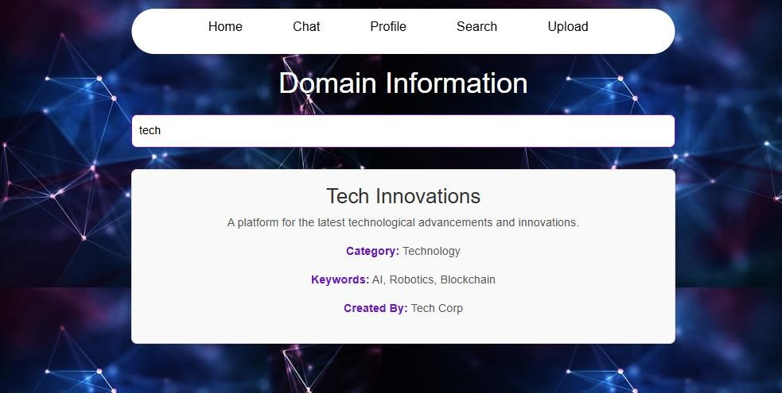

# ConnectVerse-socialmedia-app-MERN-
 A dynamic platform for professional networking, collaboration, and knowledge-sharing. Built using the MERN stack, it offers real-time chat, customizable profiles, domain-specific searches, and secure interactions in a user-friendly environment.
# ConnectVerse: A Platform to Exchange Your Thoughts

## Overview
**ConnectVerse** is an innovative platform designed to facilitate professional networking, meaningful interactions, and intellectual growth. It enables users to connect, share ideas, and expand their professional horizons through an intuitive and user-friendly interface.

Key features include:
- **Customizable Profiles**: Personalize your digital presence with bios, profile pictures, and activity logs.
- **Domain-Specific Search**: Explore topics of interest and connect with like-minded professionals.
- **Real-Time Chat**: Engage in one-on-one or group discussions seamlessly.
- **Content Sharing**: Share thoughts, posts, and media across a variety of domains.
- **Secure Interactions**: Advanced privacy controls to safeguard your digital experience.

---

## Features with Screenshots

### 1. Registration Page
Easily sign up by providing your details, creating a secure account to join the ConnectVerse community.


---

### 2. Login Page
Log in seamlessly with your credentials to access the platform's features.


---

### 3. Home Page
Your central hub with quick access to features like chat, posts, search, and more.


---

### 4. Upload Page
Share your thoughts, images, or other content with the community.


---

### 5. Profile Page
Customize your profile with a picture and bio to personalize your presence.


---

### 6. Domain Search
Search by domain to discover content, topics, or users relevant to your interests.



---

### 7. Chat Page
Engage in real-time conversations with friends and groups.


---

## Technology Stack
**Frontend**: 
- React.js for building dynamic and responsive user interfaces.
- Bootstrap and CSS for modern, responsive design.

**Backend**:
- Node.js and Express.js for server-side logic and API management.

**Database**:
- MongoDB for flexible and scalable data storage.

**Development Tools**:
- Visual Studio Code with extensions for efficient development.
- Git for version control and collaboration.

---

## Installation and Setup
1. Clone the repository:
   ```bash
   git clone https://github.com/your-username/connectverse.git
